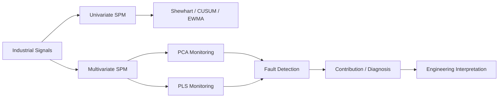
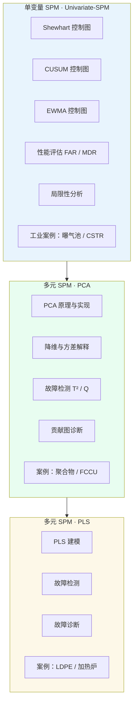

<div align="center">

# 工业过程统计监控（Statistical Process Monitoring）

**基于 Jupyter Notebook 的工业过程健康监控实战教程**

涵盖单变量控制图、PCA 与 PLS 多元统计监控，配套真实工业数据集与完整代码实现。

[](https://www.python.org/)
[](https://jupyter.org/)
[](https://scikit-learn.org/)

</div>

---

## Portfolio Value

This repository demonstrates industrial analytics and explainable monitoring skills. It moves from classic univariate control charts to PCA/PLS-based multivariate monitoring, showing how process engineers detect abnormal behavior, diagnose contributing variables, and evaluate monitoring performance.



## Skills Demonstrated

- Statistical process monitoring for industrial systems.
- Control chart design and performance evaluation.
- PCA and PLS modeling for multivariate process data.
- Fault detection and diagnosis with interpretable statistics.
- Jupyter-based analytical storytelling with reproducible code.
- Process engineering mindset: monitoring, diagnosis, and operational decision support.

## 目录

- [项目简介](#项目简介)
- [为什么学习统计过程监控](#为什么学习统计过程监控)
- [知识体系](#知识体系)
- [项目结构](#项目结构)
- [学习路径](#学习路径)
- [环境配置](#环境配置)
- [快速开始](#快速开始)
- [数据集说明](#数据集说明)
- [Notebook 索引](#notebook-索引)
- [核心概念速查](#核心概念速查)

---

## 项目简介

现代工业装置高度复杂，对过程性能与设备健康进行 **7×24 小时监控**，并对潜在故障进行早期预警，已是过程工业中的刚性需求。

本项目是一套面向**过程工业**的统计过程监控（SPM, Statistical Process Monitoring）实践教程，系统讲解多年来在复杂装置健康监控中行之有效的主流技术，帮助你掌握：

| 能力 | 说明 |
|------|------|
| **故障检测（Fault Detection）** | 判断过程或信号是否偏离正常工况 |
| **故障诊断（Fault Diagnosis）** | 定位哪些过程变量对异常贡献最大 |
| **模型构建与评估** | 从数据探索、建模到控制限设定与性能指标计算 |

所有示例均以 **Jupyter Notebook** 形式呈现，代码可直接运行，图表与推导步骤完整保留，适合自学、教学或工程参考。

---

## 为什么学习统计过程监控

尽管深度学习在诸多领域备受关注，**经典统计方法仍是工业过程监控的基石**，并在石化、化工、制药等行业广泛应用。

与神经网络相比，PCA（主成分分析）、PLS（偏最小二乘）等多元统计技术具有显著优势：

- **可解释性强** — 监控统计量（T²、Q、SPE 等）有明确统计含义
- **开发与维护成本低** — 无需大量标注数据与复杂调参
- **工程验证充分** — 大量工业成功案例，性能往往不亚于复杂黑盒模型
- **与 DCS/SCADA 集成友好** — 计算轻量，适合在线部署

---

## 知识体系



---

## 项目结构

```
Statistical-Process/
├── README.md                          # 本文件
│
├── Univariate-SPM/                    # 单变量统计过程监控
│   ├── Shewhart-Control-Charts/       # Shewhart 控制图
│   ├── CUSUM-Control-Charts/          # CUSUM 累积和控制图
│   ├── EWMA-Control-Charts/           # 指数加权移动平均控制图
│   ├── Control-Chart-Performance/     # 控制图性能指标
│   ├── Control-Chart-Shortcomings/    # 经典控制图局限性
│   ├── Aeration-Tank-CaseStudy/       # 曝气池工业案例
│   └── CSTR-Monitoring-using-Model-Residuals/  # CSTR 残差监控（ARMA）
│
├── Multivariate-SPM-PCA/              # 基于 PCA 的多元监控
│   ├── Introduction-to-PCA/           # PCA 入门（3D 数值示例）
│   ├── PCA-Under-the-Hood/            # PCA 原理剖析
│   ├── Case-Study-Polymer-Manufacturing/  # 聚合物制造降维案例
│   ├── PCA-FD-Implementation/         # 工业过程故障检测
│   ├── PCA-Diagnosis-implementation/  # 贡献图故障隔离
│   └── FCC-monitoring-via-PCA/        # 催化裂化（FCCU）换热器结垢
│
└── Multivariate-SPM-PLS/              # 基于 PLS 的多元监控
    ├── LDPE-Modeling-PLS/             # 低密度聚乙烯反应器建模
    ├── PLS-Fault-Detection/           # PLS 故障检测
    ├── PLS-Fault-Diagnosis/           # PLS 故障诊断
    └── exercise-Furnace/              # 加热炉监控编程练习
```

每个子目录均包含对应的 Notebook 与数据文件；部分目录附有 `info.txt` 或 `README.md` 补充说明。

---

## 学习路径

建议按以下顺序学习，由浅入深、由单变量到多元：

### 第一阶段：单变量监控基础

1. **Shewhart 控制图** — 理解 3σ 控制限与均值漂移检测
2. **CUSUM / EWMA** — 学习对小幅漂移更敏感的累积和与指数加权方法
3. **性能评估** — 掌握 FAR（误报率）与 MDR（漏检率）
4. **局限性** — 认识自相关信号对经典控制图的影响
5. **工业案例** — 曝气池、CSTR 残差监控

### 第二阶段：PCA 多元监控

1. **PCA 入门** — 3D 数据集上的实现与应用
2. **原理剖析** — 主成分方差解释与碎石图
3. **聚合物案例** — 真实工业数据降维
4. **故障检测** — T² 与 Q（SPE）统计量及控制限
5. **故障诊断** — 贡献图（Contribution Plot）隔离异常变量
6. **FCCU 案例** — 催化裂化装置换热器结垢场景

### 第三阶段：PLS 多元监控

1. **LDPE 建模** — 使用 scikit-learn 拟合 PLS 回归模型
2. **故障检测与诊断** — 基于 PLS 的监控统计量
3. **加热炉练习** — 数据探索与完整监控流程实战

---

## 环境配置

### 系统要求

- Python **3.8+**
- 建议使用虚拟环境（venv 或 conda）

### 安装依赖

```bash
# 克隆或进入项目目录后
python -m venv .venv

# Windows
.venv\Scripts\activate

# macOS / Linux
source .venv/bin/activate

# 安装核心依赖
pip install numpy pandas matplotlib scikit-learn seaborn scipy statsmodels openpyxl jupyter
```

### 主要依赖说明

| 包 | 用途 |
|----|------|
| `numpy` / `pandas` | 数值计算与数据处理 |
| `matplotlib` | 控制图、监控图、贡献图可视化 |
| `scikit-learn` | PCA、PLS、数据标准化 |
| `seaborn` | 部分 Notebook 的相关性热力图 |
| `scipy` | 统计检验与科学计算 |
| `statsmodels` | CSTR 案例中的 ARMA/ARIMA 时序建模 |
| `openpyxl` | 读取聚合物过程 `proc1a.xlsx` |
| `jupyter` | 运行 Notebook |

---

## 快速开始

```bash
# 1. 激活虚拟环境（见上文）

# 2. 启动 Jupyter Lab 或 Notebook
jupyter lab
# 或
jupyter notebook

# 3. 从推荐入口开始，例如：
#    Univariate-SPM/Shewhart-Control-Charts/ShewhartControlChart_2sigmaDrift_Complete.ipynb
```

> **提示**：运行 Notebook 前请确认工作目录与数据文件位于同一文件夹（Notebook 内使用相对路径加载 CSV / XLSX）。

---

## 数据集说明

| 数据集 | 路径 | 场景 | 原始来源 |
|--------|------|------|----------|
| 3D 数值示例 | `Multivariate-SPM-PCA/Introduction-to-PCA/3D_numericalDataset.csv` | PCA 教学 | 课程配套 |
| 聚合物过程 `proc1a.xlsx` | `Multivariate-SPM-PCA/Case-Study-Polymer-Manufacturing/` | 化工过程降维与 FDD | Umetrics / 多元数据分析资料 |
| FCCU 正常运行数据 | `Multivariate-SPM-PCA/FCC-monitoring-via-PCA/NOC_varyingFeedFlow_outputs.csv` | 催化裂化 NOC 训练 | 课程配套 |
| FCCU 结垢故障数据 | `Multivariate-SPM-PCA/FCC-monitoring-via-PCA/UAf_decrease_outputs.csv` | 换热器结垢检测 | 课程配套 |
| LDPE 过程数据 | `Multivariate-SPM-PLS/LDPE-Modeling-PLS/LDPE.csv` | 聚乙烯反应器 PLS | [openmv.net](https://openmv.net) |
| 加热炉数据 | `Multivariate-SPM-PLS/exercise-Furnace/*.csv` | 加热炉监控练习 | 课程配套 |
| CSTR 温度数据 | `Univariate-SPM/CSTR-Monitoring-using-Model-Residuals/CSTR_controlledTemperature.csv` | 残差时序监控 | 课程配套 |

> 若分享或使用上述数据集，请遵守各数据集的许可政策及引用要求。部分原始下载链接可能已失效，数据文件已随仓库一并提供。

---

## Notebook 索引

### 单变量 SPM（`Univariate-SPM/`）

| 目录 | Notebook | 主题 |
|------|----------|------|
| Shewhart-Control-Charts | `ShewhartControlChart_2sigmaDrift_Complete.ipynb` | 均值漂移 2σ 的 Shewhart 图 |
| Shewhart-Control-Charts | `ShewhartControlChart_half_sigmaDrift_Complete.ipynb` | 均值漂移 0.5σ 的 Shewhart 图 |
| CUSUM-Control-Charts | `CUSUMControlChart_2sigmaDrift_Complete.ipynb` | 均值漂移 2σ 的 CUSUM 图 |
| CUSUM-Control-Charts | `CUSUMControlChart_half_sigmaDrift_Complete.ipynb` | 均值漂移 0.5σ 的 CUSUM 图 |
| EWMA-Control-Charts | `EWMAControlChart_AerationTank_Complete.ipynb` | 曝气池 EWMA 监控 |
| Control-Chart-Performance | `FAR_MDR_Metrics_Complete.ipynb` | FAR 与 MDR 计算 |
| Control-Chart-Shortcomings | `AutocorrelatedSignal_FAR.ipynb` | 自相关信号下的高误报率 |
| Aeration-Tank-CaseStudy | `CUSUMControlChart_AerationTank_Complete.ipynb` | 曝气池 CUSUM 监控 |
| CSTR-Monitoring-using-Model-Residuals | `Monitor-Signal-Using-Time-Seriers-Residuals.ipynb` | ARMA 残差监控受控变量 |

### 多元 SPM · PCA（`Multivariate-SPM-PCA/`）

| 目录 | Notebook | 主题 |
|------|----------|------|
| Introduction-to-PCA | `PCA_implementation_simple3D_Complete.ipynb` | Sklearn 实现 PCA（3D 数据） |
| Introduction-to-PCA | `PCA_application_simple3D_Complete.ipynb` | PCA 应用（3D 数据） |
| PCA-Under-the-Hood | `PCA_ScoreVariances_simple3D_Complete.ipynb` | 主成分捕获的方差 |
| Case-Study-Polymer-Manufacturing | `PCA_IndustrialProcessDimensionalityReduction_Complete.ipynb` | 工业过程降维 |
| PCA-FD-Implementation | `PCA_IndustrialProcess_FD_Complete.ipynb` | 故障检测实现 |
| PCA-Diagnosis-implementation | `PCA_IndustrialProcess_Diagnosis_Complete.ipynb` | 贡献图故障隔离 |
| FCC-monitoring-via-PCA | `FCCU_dataExplore_HeatExchanger_Fouling.ipynb` | 换热器结垢数据探索 |
| FCC-monitoring-via-PCA | `FCCU_FDD_via_PCA_HeatExchanger_Fouling_Complete.ipynb` | FCCU 完整 FDD 流程 |
| FCC-monitoring-via-PCA | `FCCU_FDD_via_PCA_HeatExchanger_Fouling_inComplete.ipynb` | FCCU FDD 练习版（待补全） |

### 多元 SPM · PLS（`Multivariate-SPM-PLS/`）

| 目录 | Notebook | 主题 |
|------|----------|------|
| LDPE-Modeling-PLS | `PLS_LDPEreactorModeling_completete.ipynb` | LDPE 反应器 PLS 建模 |
| PLS-Fault-Detection | `PLS_FaultDetection_completete.ipynb` | LDPE 反应器 PLS 故障检测 |
| PLS-Fault-Diagnosis | `PLS_FaultDiagnosis_completete.ipynb` | LDPE 反应器 PLS 故障诊断 |
| exercise-Furnace | `furnace_dataExplore.ipynb` | 加热炉数据探索 |
| exercise-Furnace | `Furnace_Monitoring_via_PLS_completete.ipynb` | 基于 PLS 的加热炉监控 |

---

## 核心概念速查

| 术语 | 英文 | 简要说明 |
|------|------|----------|
| 统计过程监控 | SPM | 利用统计方法监控过程是否处于受控状态 |
| 正常运行工况 | NOC | Normal Operating Conditions，用于建立基准模型 |
| 故障检测与诊断 | FDD | Fault Detection and Diagnosis |
| 误报率 | FAR | False Alarm Rate，正常时被判定为故障的比例 |
| 漏检率 | MDR | Missed Detection Rate，故障时未被检出的比例 |
| 主成分分析 | PCA | 降维并提取数据主要变异方向 |
| 偏最小二乘 | PLS | 同时考虑 X-Y 相关性的降维回归方法 |
| Hotelling T² | T² | 得分空间（主元子空间）的多元监控统计量 |
| Q 统计量 / SPE | Q / SPE | 残差空间（正交补空间）的监控统计量 |
| 贡献图 | Contribution Plot | 量化各变量对监控统计量异常的贡献 |
| Shewhart 图 | — | 基于 3σ 原则的经典控制图 |
| CUSUM | — | 累积和 control chart，对小漂移敏感 |
| EWMA | — | 指数加权移动平均控制图 |

---

<div align="center">

**从单变量控制图到多元 PCA/PLS，构建可解释、可落地的工业过程监控能力。**

</div>
